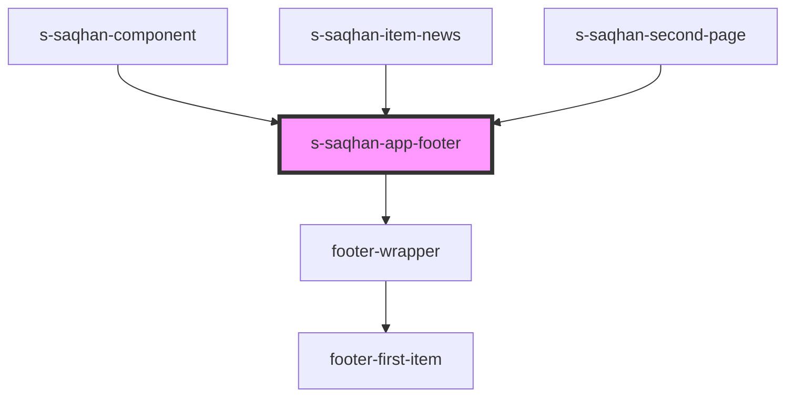

# s-saqhan-app-footer

<!-- Auto Generated Below -->

## Properties

| Property          | Attribute          | Description              | Type  | Default     |
| ----------------- | ------------------ | ------------------------ | ----- | ----------- |
| `footerCopyright` | `footer-copyright` | Текст для копирайта      | `any` | `undefined` |
| `footerInfo`      | `footer-info`      | Инфо о компании в футере | `any` | `undefined` |
| `footerItems`     | `footer-items`     | массив меню для вывода   | `any` | `undefined` |

## Events

| Event         | Description             | Type               |
| ------------- | ----------------------- | ------------------ |
| `clickOnMenu` | клик по кнопке в футере | `CustomEvent<any>` |

## Dependencies

### Used by

 - [s-saqhan-component](../../../s-saqhan-component)
 - [s-saqhan-item-news](../../../s-saqhan-item-news)
 - [s-saqhan-second-page](../../../s-saqhan-second-page)

### Depends on

- [footer-wrapper](./res/view/footer-wrapper)

### Graph

----------------------------------------------

*Built with [StencilJS](https://stenciljs.com/)*
