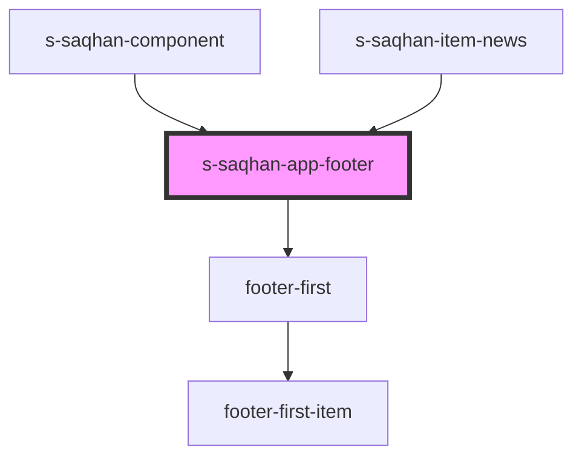

# s-saqhan-app-footer

<!-- Auto Generated Below -->

## Properties

| Property      | Attribute      | Description             | Type  | Default     |
| ------------- | -------------- | ----------------------- | ----- | ----------- |
| `footerInfo`  | `footer-info`  | клик по кнопке в футере | `any` | `undefined` |
| `footerItems` | `footer-items` | массив меню для вывода  | `any` | `undefined` |

## Events

| Event         | Description | Type               |
| ------------- | ----------- | ------------------ |
| `clickOnMenu` |             | `CustomEvent<any>` |

## Dependencies

### Used by

 - [s-saqhan-component](../../../s-saqhan-component)
 - [s-saqhan-item-news](../../../s-saqhan-item-news)

### Depends on

- [footer-first](./res/view/footer-first)

### Graph

----------------------------------------------

*Built with [StencilJS](https://stenciljs.com/)*
