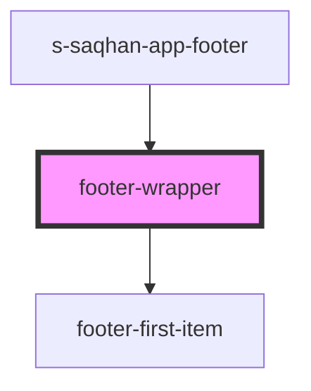

# footer-first

<!-- Auto Generated Below -->

## Properties

| Property | Attribute | Description     | Type  | Default     |
| -------- | --------- | --------------- | ----- | ----------- |
| `footer` | `footer`  | массив 1 футера | `any` | `undefined` |

## Events

| Event         | Description        | Type               |
| ------------- | ------------------ | ------------------ |
| `clickOnMenu` | Клик на пункт меню | `CustomEvent<any>` |

## Dependencies

### Used by

 - [s-saqhan-app-footer](../../..)

### Depends on

- [footer-first-item](./res/view/footer-first-item)

### Graph

----------------------------------------------

*Built with [StencilJS](https://stenciljs.com/)*
