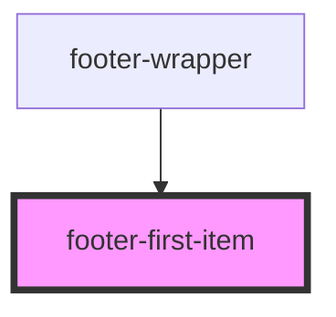

# footer-first-item

<!-- Auto Generated Below -->

## Properties

| Property | Attribute | Description | Type  | Default     |
| -------- | --------- | ----------- | ----- | ----------- |
| `arr`    | `arr`     |             | `any` | `undefined` |

## Events

| Event         | Description | Type               |
| ------------- | ----------- | ------------------ |
| `clickOnMenu` |             | `CustomEvent<any>` |

## Dependencies

### Used by

 - [footer-wrapper](../../..)

### Graph

----------------------------------------------

*Built with [StencilJS](https://stenciljs.com/)*
