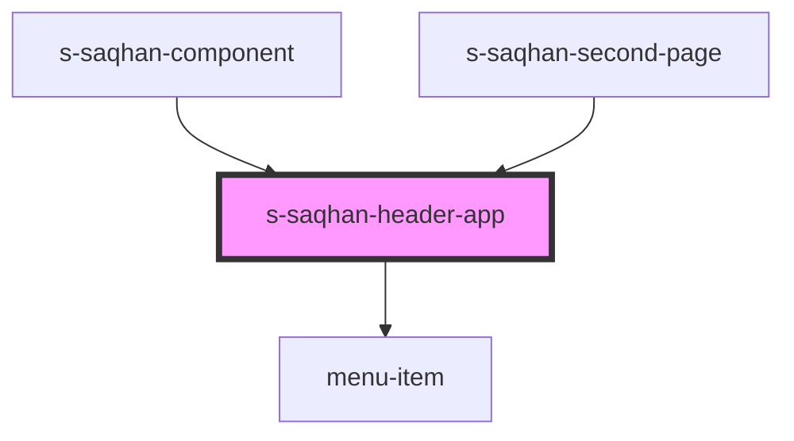

# s-saqhan-header-app

<!-- Auto Generated Below -->

## Properties

| Property        | Attribute        | Description                       | Type                      | Default     |
| --------------- | ---------------- | --------------------------------- | ------------------------- | ----------- |
| `logoUrl`       | `logo-url`       | ссылка на изображение логотипа    | `any`                     | `undefined` |
| `menu`          | --               | массив меню для вывода            | `SSaqhanHedearMenuItem[]` | `[]`        |
| `subscribeText` | `subscribe-text` | текст вывода в кнопке подписаться | `string`                  | `undefined` |

## Events

| Event                    | Description                | Type                                 |
| ------------------------ | -------------------------- | ------------------------------------ |
| `clickOnMenu`            | клик по конкретному меню   | `CustomEvent<SSaqhanHedearMenuItem>` |
| `clickOnSubscribeButton` | клик по кнопке подписаться | `CustomEvent<any>`                   |
| `clickToLogo`            | клик по лого               | `CustomEvent<any>`                   |

## Dependencies

### Used by

 - [s-saqhan-component](../../../s-saqhan-component)
 - [s-saqhan-second-page](../../../s-saqhan-second-page)

### Depends on

- [menu-item](./res/view/menu-item)

### Graph

----------------------------------------------

*Built with [StencilJS](https://stenciljs.com/)*
