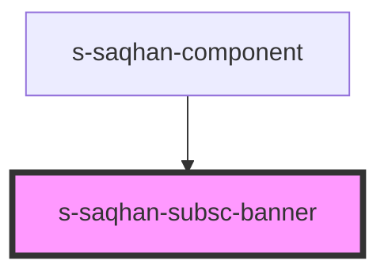

# s-saqhan-subsc-banner

<!-- Auto Generated Below -->

## Properties

| Property             | Attribute        | Description                       | Type                         | Default     |
| -------------------- | ---------------- | --------------------------------- | ---------------------------- | ----------- |
| `subscribeBlockText` | --               | Массив данных для черного баннера | `clickOnSubscribeButtonItem` | `undefined` |
| `subscribeText`      | `subscribe-text` | текст вывода в кнопке подписаться | `string`                     | `undefined` |

## Events

| Event                    | Description                | Type               |
| ------------------------ | -------------------------- | ------------------ |
| `clickOnSubscribeButton` | клик по кнопке подписаться | `CustomEvent<any>` |

## Dependencies

### Used by

 - [s-saqhan-component](../../../s-saqhan-component)

### Graph

----------------------------------------------

*Built with [StencilJS](https://stenciljs.com/)*
