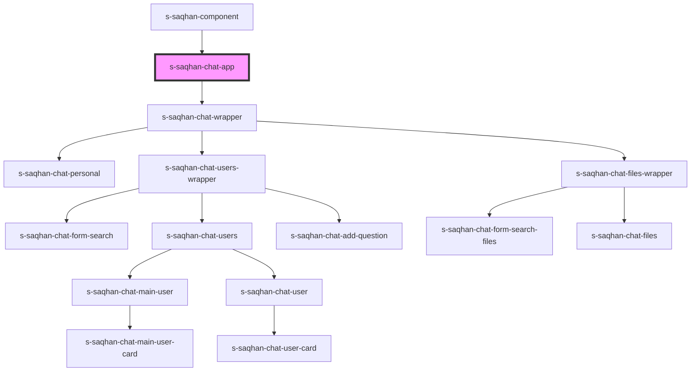

# s-saqhan-chat-app

<!-- Auto Generated Below -->

## Events

| Event            | Description | Type               |
| ---------------- | ----------- | ------------------ |
| `close`          |             | `CustomEvent<any>` |
| `selectFiles`    |             | `CustomEvent<any>` |
| `selectPersonal` |             | `CustomEvent<any>` |
| `selectUsers`    |             | `CustomEvent<any>` |

## Dependencies

### Used by

 - [s-saqhan-component](../s-saqhan-component)

### Depends on

- [s-saqhan-chat-wrapper](./res/view/s-saqhan-chat-wrapper)

### Graph

----------------------------------------------

*Built with [StencilJS](https://stenciljs.com/)*
