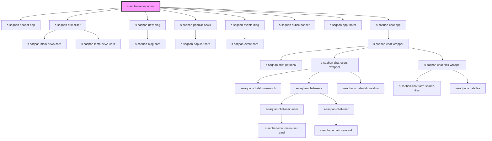

# my-component

<!-- Auto Generated Below -->

## Dependencies

### Depends on

- [s-saqhan-header-app](../res/view/s-saqhan-header-app)
- [s-saqhan-first-slider](./res/view/s-saqhan-first-slider)
- [s-saqhan-new-blog](../res/view/s-saqhan-new-blog)
- [s-saqhan-popular-news](./res/view/s-saqhan-popular-news)
- [s-saqhan-events-blog](./res/view/s-saqhan-events-blog)
- [s-saqhan-subsc-banner](../res/view/s-saqhan-subsc-banner)
- [s-saqhan-app-footer](../res/view/s-saqhan-app-footer)
- [s-saqhan-chat-app](../s-saqhan-chat-app)

### Graph

----------------------------------------------

*Built with [StencilJS](https://stenciljs.com/)*
