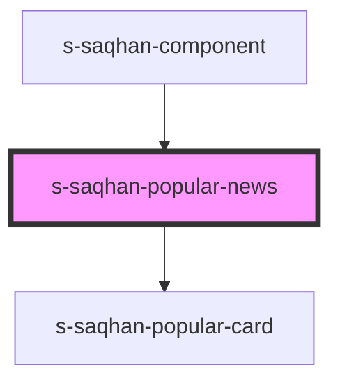

# s-saqhan-popular-news

<!-- Auto Generated Below -->

## Properties

| Property        | Attribute        | Description        | Type                       | Default     |
| --------------- | ---------------- | ------------------ | -------------------------- | ----------- |
| `bannerPopular` | `banner-popular` | Данные для баннера | `any`                      | `undefined` |
| `popularNews`   | --               | Массив публикаций  | `SSaqhanPopularCardItem[]` | `undefined` |

## Events

| Event         | Description     | Type               |
| ------------- | --------------- | ------------------ |
| `clickOnNews` | Клик по новости | `CustomEvent<any>` |

## Dependencies

### Used by

 - [s-saqhan-component](../../..)

### Depends on

- [s-saqhan-popular-card](./res/view/s-saqhan-popular-card)

### Graph

----------------------------------------------

*Built with [StencilJS](https://stenciljs.com/)*
