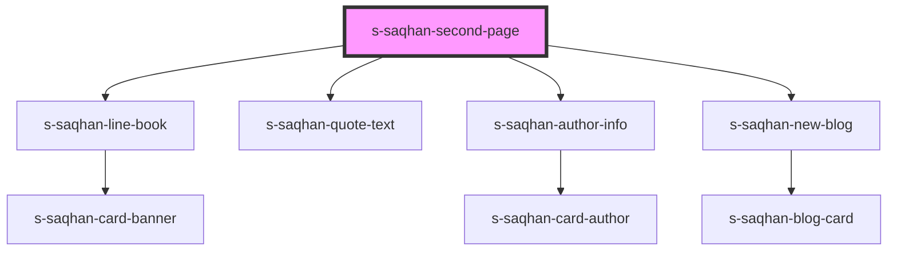

# s-saqhan-second-page

<!-- Auto Generated Below -->

## Dependencies

### Depends on

- [s-saqhan-line-book](./res/view/s-saqhan-line-book)
- [s-saqhan-quote-text](./res/view/s-saqhan-quote-text)
- [s-saqhan-author-info](./res/view/s-saqhan-author-info)
- [s-saqhan-new-blog](../res/view/s-saqhan-new-blog)

### Graph

----------------------------------------------

*Built with [StencilJS](https://stenciljs.com/)*
