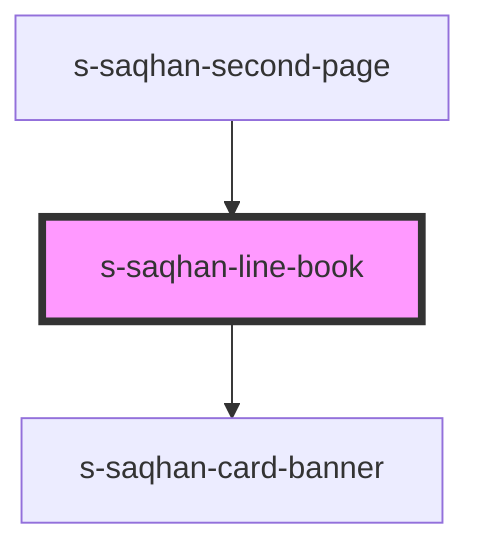

# s-saqhan-line-book

<!-- Auto Generated Below -->

## Properties

| Property | Attribute | Description | Type  | Default     |
| -------- | --------- | ----------- | ----- | ----------- |
| `banner` | `banner`  |             | `any` | `undefined` |

## Dependencies

### Used by

 - [s-saqhan-second-page](../../..)

### Depends on

- [s-saqhan-card-banner](./res/view/s-saqhan-card-banner)

### Graph

----------------------------------------------

*Built with [StencilJS](https://stenciljs.com/)*
