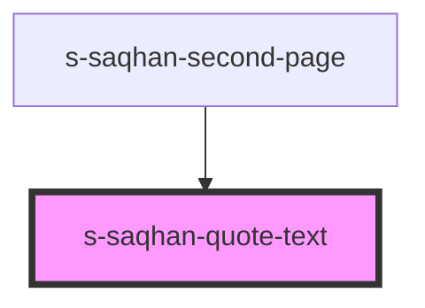

# s-saqhan-quote-text

<!-- Auto Generated Below -->

## Properties

| Property    | Attribute    | Description | Type  | Default     |
| ----------- | ------------ | ----------- | ----- | ----------- |
| `quoteText` | `quote-text` |             | `any` | `undefined` |

## Dependencies

### Used by

 - [s-saqhan-second-page](../../..)

### Graph

----------------------------------------------

*Built with [StencilJS](https://stenciljs.com/)*
