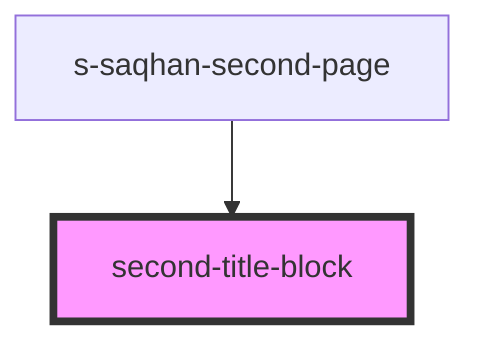

# second-title-block

<!-- Auto Generated Below -->

## Properties

| Property      | Attribute | Description                     | Type                   | Default     |
| ------------- | --------- | ------------------------------- | ---------------------- | ----------- |
| `secondTitle` | --        | массив данных для первого блока | `secondTitleBlockItem` | `undefined` |

## Events

| Event         | Description                                                           | Type               |
| ------------- | --------------------------------------------------------------------- | ------------------ |
| `clickOnLink` | события при клике на элементы первого блока в одностраничной новостиы | `CustomEvent<any>` |

## Dependencies

### Used by

 - [s-saqhan-second-page](../../..)

### Graph

----------------------------------------------

*Built with [StencilJS](https://stenciljs.com/)*
